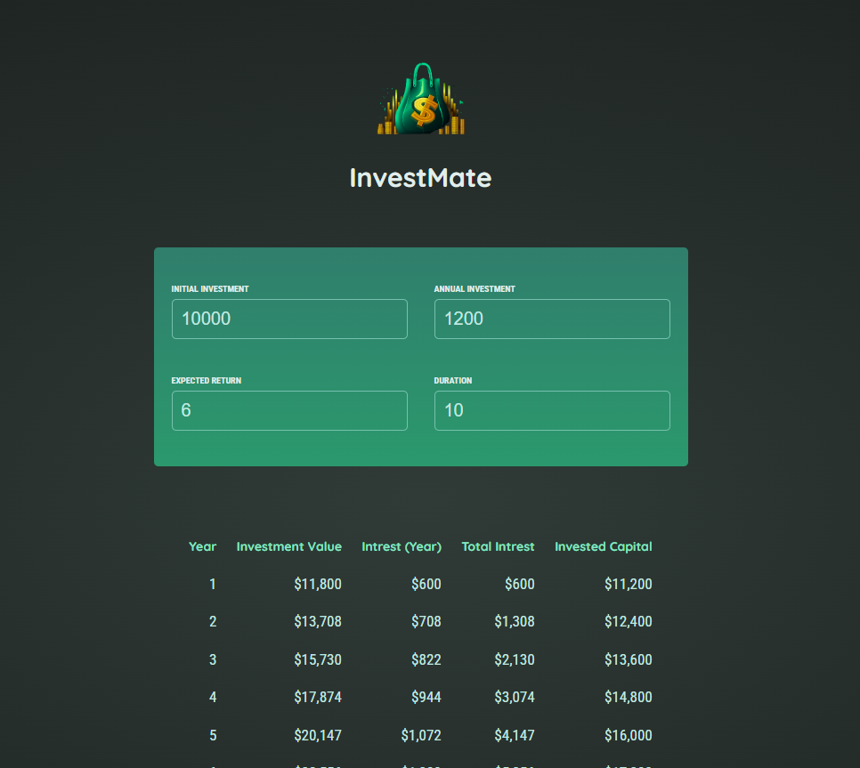

# InvestMate:

This project is an investment calculator built using React, allowing users to input their initial investment, annual investment, expected return rate, and investment duration. It then calculates and displays the investment results over the specified duration.

## Features

- **User Input Form**: Users can input their investment details including initial investment, annual investment, expected return rate, and investment duration.
- **Validation**: Input fields are validated to ensure positive values and a valid investment duration greater than zero.
- **Calculation**: Investment results are calculated based on the input provided by the user using the provided formula.
- **Result Display**: Results are displayed in a table format showing the investment value, interest earned, total interest, and invested capital for each year over the investment duration.

## Project Structure

- **`App.js`**: Main component of the React application which manages the state and renders child components.
- **`UserInput.jsx`**: Component responsible for rendering the form for user input and handling user interactions.
- **`Results.jsx`**: Component responsible for calculating and displaying the investment results based on user input.
- **`Header.jsx`**: Component for displaying the header of the application.
- **`util/investment.js`**: Contains a function to calculate investment results and a formatter for currency display.
- **`assets/investment-calculator-logo.png`**: Logo image used in the header.

## Installation

To run this project locally, follow these steps:

1. Clone the repository: `git clone <repository-url>`
2. Navigate to the project directory: `cd <project-directory>`
3. Install dependencies: `npm install`
4. Start the development server: `npm run dev`
5. Open your browser and visit `http://localhost:5173` to view the application.

## Usage

1. Input your initial investment amount, annual investment, expected return rate (as a percentage), and investment duration in years.
2. Ensure all input values are positive and the investment duration is greater than zero.
3. Once valid inputs are provided, the investment results will be displayed in a table format showing the investment value, interest earned, total interest, and invested capital for each year over the investment duration.

## Contribution

Contributions are welcome! If you have any suggestions, improvements, or feature requests, feel free to open an issue or create a pull request.

## Credits

This project was created by [Your Name] and inspired by the need for a simple investment calculator tool.

## License

This project is licensed under the MIT License. See the [LICENSE](LICENSE) file for more details.